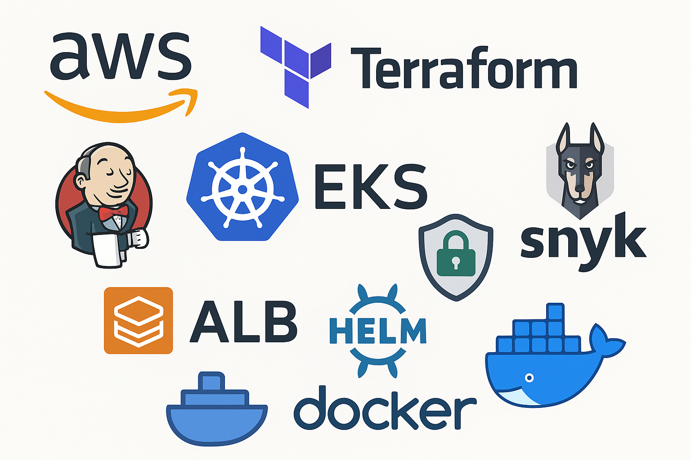

# 🚀 Full AWS EKS Infrastructure with Terraform and Jenkins

This project demonstrates how to provision and manage a complete AWS infrastructure using Terraform, deploy a Flask app to Amazon EKS, and automate CI/CD workflows with Jenkins. It also includes security scans using [Snyk](https://snyk.io/) for both Terraform (IaC) and Docker images.

## 📐 Architecture

```
Developer --> GitHub --> Jenkins --> Terraform --> AWS (EKS, ECR, IAM, VPC)
                                   |
                                   --> Docker --> ECR --> Helm --> EKS
                                   |
                                   --> Snyk scans (IaC + Container)
```

## 🧾 Project Structure

```
.
├── terraform/               # Terraform configurations for AWS resources
├── flask-app/               # Flask app with Helm chart
├── Jenkinsfile              # CI/CD pipeline definition
├── Dockerfile               # Flask app container
├── terraform.tfvars         # Input variables for Terraform
└── README.md
```

## 🛠 Prerequisites

Make sure you have the following installed and configured:

- AWS account with sufficient IAM permissions
- AWS CLI
- Terraform v1.0+
- Docker
- Jenkins server with required plugins:
  - AWS Credentials
  - Docker Pipeline
  - Git
- Helm v3
- kubectl
- [Snyk CLI](https://docs.snyk.io/snyk-cli/install-the-snyk-cli)

## ⚙️ Setup Instructions

### 1. Clone the Repository

```bash
git clone https://github.com/sahar449/Full-AWS-EKS-Infrastructure-with-Terraform-and-Jenkins.git
cd Full-AWS-EKS-Infrastructure-with-Terraform-and-Jenkins
```

### 2. Configure Terraform Variables

Edit the `terraform.tfvars` file with your desired values:

```hcl
region        = "us-west-2"
cluster_name  = "demo-cluster"
```

### 3. Provision Infrastructure with Terraform

```bash
cd terraform
terraform init
terraform apply -auto-approve
```

### 4. Set Up Jenkins

- Configure credentials:
  - AWS Access Key + Secret (`aws-creds`)
  - ECR repo URI (`ecr-repo-uri`)
  - Snyk Token (optional)
- Create a Jenkins pipeline job and link to the `Jenkinsfile` in this repository.

### 5. Run the Pipeline

The pipeline performs the following stages:

1. Clone GitHub repository  
2. Extract variables from `terraform.tfvars`  
3. Run Snyk IaC scan  
4. Create ECR repository if not exists  
5. Build & push Docker image to ECR  
6. Deploy Flask app to EKS using Helm  
7. Optionally destroy infra on failure  

## 🧪 Snyk Security Scans

The pipeline includes:
```bash
snyk iac .
```

You’ll need to provide your Snyk token as a Jenkins secret.

## 🌐 Test the Application

After deployment, port-forward or configure an Ingress (e.g. ALB via AWS Load Balancer Controller), then:

```bash
curl https://www.saharbittman.com
```

## 🧹 Destroy Infrastructure

If needed, run:

```bash
cd terraform
terraform destroy -auto-approve
```

## 📃 License

This project is licensed under the MIT License.